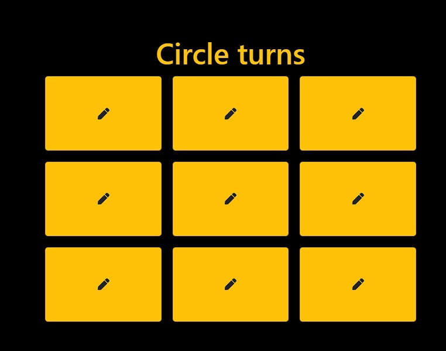

# Tic Tac Toe Game

This is a Tic Tac Toe game built using ReactJS. It is a simple game where two players take turns marking the spaces in a 3x3 grid with either a circle or a cross. The player who succeeds in placing three of their marks in a horizontal, vertical, or diagonal row wins the game.

## Installation

To install and run the game locally, follow these steps:

1. Clone this repository to your local machine
2. Install the required dependencies by running `npm install`
3. Run the development server using `npm start`

## Usage

Once the development server is running, you can access the game in your browser by navigating to `http://localhost:3000`. 

To play the game, simply click on any of the empty boxes in the grid to place your mark. The game will automatically switch turns between the two players. If a player succeeds in placing three of their marks in a row, the game will end and the winner will be displayed. 

You can also reload the game at any time by clicking the "Reload the game" button.

## Dependencies

This game was built using the following dependencies:

- ReactJS
- Reactstrap
- Bootstrap
- React Toastify

## Contributing

If you'd like to contribute to this project, feel free to fork the repository and submit a pull request with your changes.

## Screenshort

## [Play now](https://gleeful-muffin-7ce570.netlify.app/)

